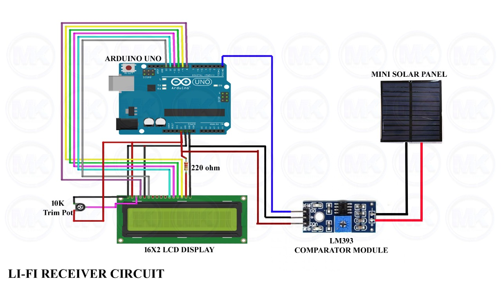
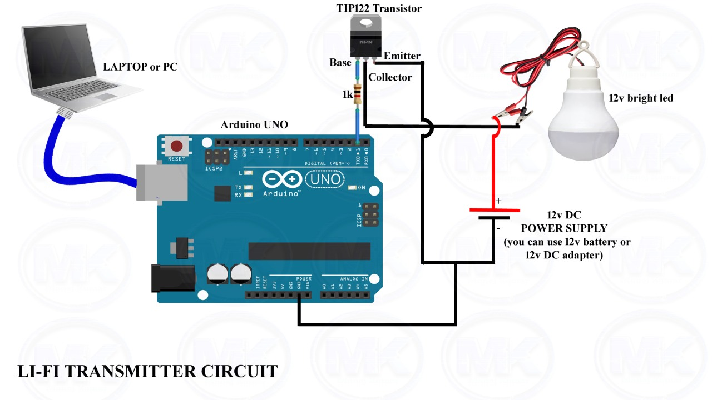
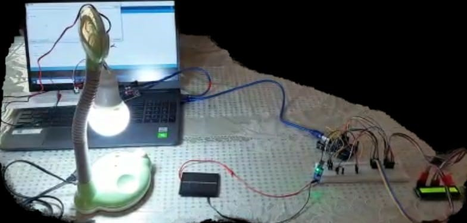

<h1 align="center">Real time data transmission using Li-Fi Technology.</h1>

<!-- ABOUT THE PROJECT -->

# Introduction
Li-fi or Light Fidelity is one of the emerging technologies in the field of internet. Li – Fi Technology utilizes the principles of VLC (Visual Light Communication). Through Li-fi, data such as text, images, voice can be transferred. Data is transmitted in several bit streams and the receiver side consisting a Light-Sensitive-Device such as an LDR detects and decodes the message. The transmission happens in the form of binary data where “0” means LED in ‘OFF’ state and “1” means that the LED is in the ‘ON’ state. Transmitter and receiver sections contain Arduino UNO which are programmed using Arduino IDE. Studies and practical observations have shown that Li-fi technology is 100 times faster than Wi-fi, which uses Radio waves to transfer Data.
  

# About the Project
Here in this project, we will be demonstrating the transmission of ‘strings’ with the help of Li-fi Technology. A 24 Character text data is transmitted with the help of an LED Bulb. This data which is transmitted from the bulb, is received by an LDR (Light dependent resistor) on the receiver’s circuit. The data Received is decoded with the help of a decoder. This project also extends on implementing Li-fi technology to transfer patient data in hospitals, where the usage of radio waves may be harmful, hence Li-fi can be a safer and secure option.
  

# Problem Statements Considered

In the existing system, the transmission rate of data transfer is relatively slow. But with the designed system, the data can be transmitted 100 times faster.

The traditional system uses radio waves to transfer data, which may not be safe for certain patients. With the implementation of this system, data can be transmitted with the help of light which may not harm such patients.

Some of the present systems may leak the user’s data, which may result in privacy issues of the patient. Through our system data security is efficiently managed.

Cost to maintain the present system may be a main factor of increased expenses, with Li-Fi such costs are significantly reduced.

The current system in use solely depends on the network providers connectivity. Failing of such connectivity may lead to lack of network facility. With the proposed system, we can overcome such dependencies.
  

# Description
* This system consists of two Isolated circuits
Transmitter circuit
Receiver circuit 
* It consists of two Arduino UNO boards.
* The transmitter circuit mainly comprises of an LED bulb and a transistor.
* The receiver circuit consists of an LDR (Light-Dependent-Resistor), comparator module and a display screen.
* Data transmitted through the LED bulb of the transmitter circuit, is received by the LDR circuit and decoded. This decoded data is displayed on the LCD screen.

  

# Block Diagram of Data Flow in Li-Fi Technology

  

# Circuit Diagram
## Receiver Circuit

## Transmitter Circuit

  

# Source Code

Transmitter Circuit Code: [here](lifi-transmitter.ino)
 
Reciever Circuit Code: [here](lifi-receiver.ino)

  

# Implementation Circuit

  

# Advantages

* Light has 10000 times wider bandwidth than radio frequency so the capacity of data transfer will be better than that of Wi-Fi.
 * Instead of using radio wave, Li-Fi uses visible light for communication. 
 * Data transmission through Li-Fi is very cheap as LED uses very less amount of energy.
 * d. Security of a Li-Fi network is much better because the light cannot penetrate the walls so no one can misuse the network.
 * The shortage issue of radio frequency bandwidth may be solved by using Li-Fi. 
 * Using Li-Fi each street lamp can be used as a free data access point. 
 * Underwater Wi-Fi does not work at all, here Li-Fi can be used for data transmission.

# Disadvantages

* The main problem with Li-Fi is how the receiver will transfer the data back to the transmitter.
* Li-Fi works on direct line of sight. 
* The network topology is point to point.

